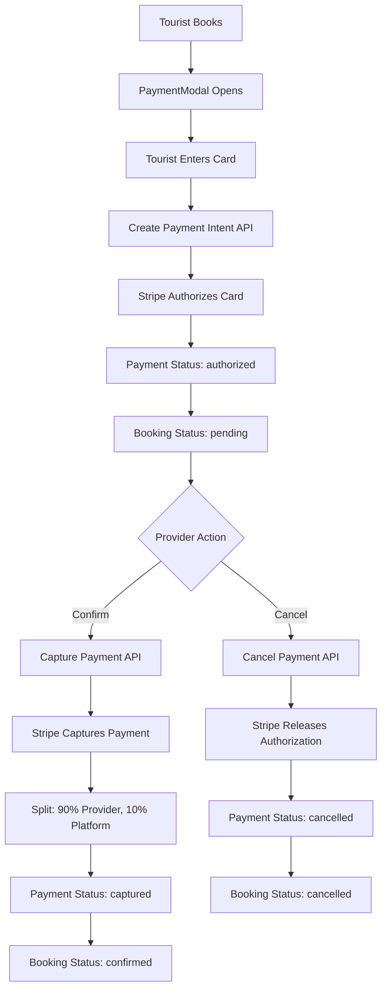

# Stripe Payment Integration - Complete Workflow Guide

## Overview

This document explains the complete Stripe payment integration workflow for the WBTH tourism platform, including authorization/capture flow, fee splitting, and all components involved.

---

## Architecture Overview



---

## Complete Payment Flow

### Phase 1: Tourist Booking & Payment Authorization

#### Step 1: Tourist Creates Booking
**Location**: `app/accommodations/[id]/page.tsx` or `app/guides/[id]/page.tsx`

```typescript
const handleBookingSubmit = async (e: React.FormEvent) => {
    // Create booking in database
    const res = await fetch("/api/bookings", {
        method: "POST",
        body: JSON.stringify({
            type: "accommodation", // or "guide"
            itemId: accommodation?.id,
            startDate, endDate, price, location
        })
    });
    
    if (res.ok) {
        const booking = await res.json();
        setCreatedBooking(booking);
        setShowPaymentModal(true); // Open payment modal
    }
};
```

**What happens:**
- Booking record created with status: `pending`
- No payment record exists yet
- PaymentModal component opens

---

#### Step 2: PaymentModal Opens
**Location**: `components/payments/PaymentModal.tsx`

**What it displays:**
- Booking summary (provider, dates, location, price)
- Stripe CardElement for card input
- Test card information
- Info message about authorization

---

#### Step 3: Tourist Submits Payment
**Location**: `components/payments/PaymentModal.tsx` → `handleSubmit()`

```typescript
// 1. Create PaymentIntent
const response = await fetch("/api/payments/create-payment-intent", {
    method: "POST",
    body: JSON.stringify({ bookingId })
});

const { clientSecret, paymentId } = await response.json();

// 2. Confirm payment with Stripe
const { paymentIntent } = await stripe.confirmCardPayment(clientSecret, {
    payment_method: { card: cardElement }
});

// 3. Update payment status to authorized
if (paymentIntent?.status === "requires_capture") {
    await fetch("/api/payments/update-status", {
        method: "POST",
        body: JSON.stringify({ paymentId, status: "authorized" })
    });
}
```

---

#### Step 4: Create Payment Intent API
**Location**: `app/api/payments/create-payment-intent/route.ts`

**What it does:**
1. Validates user session
2. Fetches booking details
3. Determines provider (guide or accommodation owner)
4. Creates Stripe PaymentIntent with `capture_method: 'manual'`
5. Creates Payment record in database

```typescript
// Create Stripe PaymentIntent
const paymentIntent = await stripe.paymentIntents.create({
    amount: Math.round(booking.price * 100), // Convert to cents
    currency: "usd",
    capture_method: "manual", // Authorization only
    metadata: {
        bookingId, userId, providerId, bookingType
    }
});

// Create Payment record
const payment = await prisma.payment.create({
    data: {
        sender_id: tourist_id,
        receiver_id: provider_id,
        booking_id: bookingId,
        amount: booking.price,
        status: "pending",
        stripe_payment_intent_id: paymentIntent.id
    }
});

return { clientSecret: paymentIntent.client_secret, paymentId: payment.id };
```

**Database State After This Step:**
- **Payment**: status = `pending`, stripe_payment_intent_id = `pi_xxx`
- **Booking**: status = `pending`

---

#### Step 5: Stripe Authorizes Card
**What happens:**
- Stripe validates the card
- Funds are **held** (not charged)
- PaymentIntent status becomes `requires_capture`
- Tourist's available balance is reduced by the amount

---

#### Step 6: Update Payment Status
**Location**: `app/api/payments/update-status/route.ts`

```typescript
await prisma.payment.update({
    where: { id: paymentId },
    data: { status: "authorized" }
});
```

**Database State After This Step:**
- **Payment**: status = `authorized`
- **Booking**: status = `pending`

**Tourist sees:** "Payment authorized successfully! Waiting for provider confirmation."

---

### Phase 2: Provider Confirmation or Cancellation

#### Step 7: Provider Views Pending Booking
**Location**: `app/dashboard/provider/page.tsx` or `app/dashboard/guide/page.tsx`

**What provider sees:**
- Booking with status: `pending`
- Two buttons: "✅ Confirm" and "❌ Reject"

---

#### Step 8a: Provider Confirms (Capture Payment)

**Location**: `app/dashboard/provider/page.tsx` → `handleConfirmBooking()`

```typescript
const handleConfirmBooking = async (bookingId: string) => {
    // 1. Get payment for this booking
    const paymentRes = await fetch(`/api/payments/by-booking/${bookingId}`);
    const { payment } = await paymentRes.json();
    
    // 2. Capture the payment
    const res = await fetch("/api/payments/capture", {
        method: "POST",
        body: JSON.stringify({ paymentId: payment.id })
    });
    
    if (res.ok) {
        const { providerAmount } = await res.json();
        alert(`Payment captured! You received $${providerAmount}`);
    }
};
```

---

#### Step 9: Capture Payment API
**Location**: `app/api/payments/capture/route.ts`

**What it does:**
1. Fetches payment and validates provider
2. Finds Stripe PaymentIntent
3. Captures the payment with Stripe
4. Calculates fee split (10% platform, 90% provider)
5. Updates payment records
6. Updates booking status
7. Sends notifications

```typescript
// 1. Capture payment with Stripe
const capturedIntent = await stripe.paymentIntents.capture(paymentIntent.id);

// 2. Calculate fees
const { platformFee, providerAmount } = calculateFees(payment.amount);
// Example: $100 → platformFee: $10, providerAmount: $90

// 3. Update original payment (provider's share)
await prisma.payment.update({
    where: { id: paymentId },
    data: { status: "captured", amount: providerAmount } // $90
});

// 4. Create platform fee payment
await prisma.payment.create({
    data: {
        sender_id: provider_id,
        receiver_id: admin_id,
        booking_id: payment.booking_id,
        amount: platformFee, // $10
        status: "captured"
    }
});

// 5. Update booking status
await prisma.booking.update({
    where: { id: payment.booking_id },
    data: { status: "confirmed" }
});

// 6. Send notifications
// - Tourist: "Your payment of $100 has been processed"
// - Provider: "You received $90 for booking confirmation"
// - Tourist: "Your booking has been confirmed!"
```

**Database State After Capture:**
- **Payment 1** (Tourist → Provider): status = `captured`, amount = $90
- **Payment 2** (Provider → Admin): status = `captured`, amount = $10
- **Booking**: status = `confirmed`

---

#### Step 8b: Provider Cancels (Release Authorization)

**Location**: `app/dashboard/provider/page.tsx` → `handleCancelBooking()`

```typescript
const handleCancelBooking = async (bookingId: string) => {
    // 1. Get payment for this booking
    const paymentRes = await fetch(`/api/payments/by-booking/${bookingId}`);
    const { payment } = await paymentRes.json();
    
    // 2. Cancel the payment
    const res = await fetch("/api/payments/cancel", {
        method: "POST",
        body: JSON.stringify({ paymentId: payment.id })
    });
};
```

---

#### Step 10: Cancel Payment API
**Location**: `app/api/payments/cancel/route.ts`

**What it does:**
1. Fetches payment and validates provider
2. Finds Stripe PaymentIntent
3. Cancels the PaymentIntent (releases hold)
4. Updates payment status
5. Updates booking status
6. Sends notifications

```typescript
// 1. Cancel with Stripe (releases authorization)
await stripe.paymentIntents.cancel(paymentIntent.id);

// 2. Update payment status
await prisma.payment.update({
    where: { id: paymentId },
    data: { status: "cancelled" }
});

// 3. Update booking status
await prisma.booking.update({
    where: { id: payment.booking_id },
    data: { status: "cancelled" }
});

// 4. Send notifications
// - Tourist: "Your booking has been cancelled and payment authorization released"
// - Provider: "You cancelled the booking"
```

**Database State After Cancel:**
- **Payment**: status = `cancelled`
- **Booking**: status = `cancelled`
- **Tourist's card**: Authorization released, funds available again

---

## Database Schema

### Payment Model
```prisma
model Payment {
  id                       String        @id @default(uuid())
  sender_id                String        // Tourist ID
  receiver_id              String        // Provider or Admin ID
  booking_id               String        // Related booking
  amount                   Float         // Amount in dollars
  status                   PaymentStatus // pending/authorized/captured/cancelled
  stripe_payment_intent_id String?       // Stripe PaymentIntent ID
  
  booking  Booking @relation(fields: [booking_id], references: [id])
  receiver User    @relation("ReceiverPayments", fields: [receiver_id], references: [id])
  sender   User    @relation("SenderPayments", fields: [sender_id], references: [id])
}

enum PaymentStatus {
  pending     // Initial state
  authorized  // Card authorized, funds held
  captured    // Payment completed
  cancelled   // Authorization released
  failed      // Payment failed
}
```

---

## Payment Status Flow

```
pending → authorized → captured (successful flow)
                    ↘ cancelled (provider rejects)
```

---

## Fee Splitting Logic

**Location**: `lib/stripe.ts` → `calculateFees()`

```typescript
export function calculateFees(totalAmount: number): {
    platformFee: number;
    providerAmount: number;
} {
    const feePercentage = getPlatformFeePercentage(); // 10% from env
    const platformFee = Math.round((totalAmount * feePercentage) / 100);
    const providerAmount = totalAmount - platformFee;
    
    return { platformFee, providerAmount };
}
```

**Example:**
- Booking price: $100
- Platform fee (10%): $10
- Provider receives: $90

---

## Dashboard Income Calculations

### Tourist Dashboard
**Location**: `components/touristdashboard/BookingHistorySection.tsx`

**Displays:**
- Booking status (pending/confirmed/cancelled)
- Payment status (pending/authorized/captured/cancelled)
- Amount paid

### Provider Dashboard (Guide/Accommodation)
**Location**: `app/api/guide/bookings/route.ts` and `app/api/accommodation-provider/bookings/route.ts`

**Income Calculation:**
```typescript
// Calculate income from captured payments only
const capturedPayments = await prisma.payment.findMany({
    where: {
        receiver_id: userId,
        status: "captured"
    }
});

const totalIncome = capturedPayments.reduce((sum, payment) => sum + payment.amount, 0);
```

**Shows:** Actual income received (90% of booking prices)

### Admin Dashboard
**Location**: `app/api/admin/analytics/route.ts`

**Platform Income Calculation:**
```typescript
const adminUser = await prisma.admin.findFirst();

const platformPayments = await prisma.payment.findMany({
    where: {
        receiver_id: adminUser.user_id,
        status: "captured"
    }
});

const platformIncome = platformPayments.reduce((sum, payment) => sum + payment.amount, 0);
```

**Shows:** Total platform fees collected (10% of all confirmed bookings)

---

## Key Components

### 1. PaymentModal Component
**File**: `components/payments/PaymentModal.tsx`
- Wraps Stripe Elements provider
- Displays booking summary
- Handles card input
- Manages payment submission
- Shows loading/error states

### 2. Stripe Utility
**File**: `lib/stripe.ts`
- Initializes Stripe instance
- Calculates platform fee
- Splits payment amounts

### 3. Payment APIs
**Directory**: `app/api/payments/`
- `create-payment-intent/` - Creates PaymentIntent
- `capture/` - Captures authorized payment
- `cancel/` - Cancels authorization
- `update-status/` - Updates payment status
- `by-booking/[bookingId]/` - Fetches payment by booking

---

## Environment Variables

```env
# Stripe Configuration
STRIPE_SECRET_KEY=sk_test_...
NEXT_PUBLIC_STRIPE_PUBLISHABLE_KEY=pk_test_...
PLATFORM_FEE_PERCENTAGE=10
```

---

## Testing

### Test Cards
- **Success**: `4242 4242 4242 4242`
- **Decline**: `4000 0000 0000 0002`
- **Requires Authentication**: `4000 0025 0000 3155`

Use any future expiry date, any CVC, any ZIP (e.g., 12345)

### Test Flow
1. Login as tourist
2. Book accommodation/guide
3. Enter test card in PaymentModal
4. Verify payment status: `authorized`
5. Login as provider
6. Confirm booking
7. Verify payment captured and split correctly
8. Check all dashboards show updated amounts

---

## Security Considerations

1. **Server-side validation**: All payment operations validated on server
2. **User authentication**: Session required for all payment APIs
3. **Provider verification**: Only the provider can confirm/cancel their bookings
4. **Stripe secret key**: Never exposed to client (server-side only)
5. **Manual capture**: Prevents charging before provider confirmation

---

## Error Handling

### Payment Creation Errors
- Invalid booking ID
- Missing provider
- Stripe API errors
- Network failures

### Payment Capture Errors
- Payment already captured
- Payment cancelled
- Stripe capture failure
- Provider not authorized

### Payment Cancel Errors
- Payment already captured (can't cancel)
- Payment already cancelled
- Stripe cancel failure

All errors are logged and user-friendly messages displayed.

---

## Summary

The Stripe payment integration uses a **two-step authorization/capture flow**:

1. **Authorization**: Tourist's card is validated and funds held
2. **Capture**: Provider confirms, payment is charged and split

This ensures tourists aren't charged until providers confirm, while guaranteeing funds are available when providers accept bookings.
